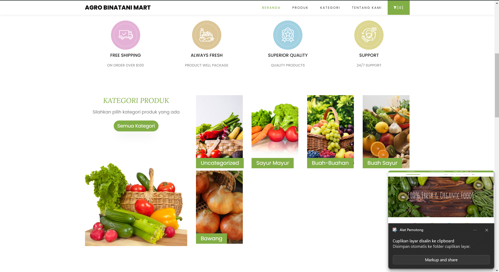

# Sistem Penjualan Hasil Tani

Sistem Penjualan Produk Hasil Pertanian menggunakan PHP adalah aplikasi berbasis web yang memfasilitasi transaksi penjualan produk pertanian secara online. Sistem ini memungkinkan petani atau pengepul untuk mengelola produk pertanian yang tersedia, mencatat transaksi penjualan, serta memonitor stok barang.


## Tampilan Demo




## Fitur Utama
- **Manajemen Produk**: Menambahkan, mengedit, dan menghapus produk pertanian yang tersedia untuk dijual.
- **Pencatatan Transaksi**: Menyimpan data transaksi penjualan antara penjual (petani/pengepul) dan pembeli.
- **Manajemen Stok**: Memantau stok produk yang tersedia dan secara otomatis mengurangi stok setelah penjualan.
- **Laporan Transaksi**: Menghasilkan laporan transaksi penjualan dalam periode tertentu.
- **Pembayaran Online**: Fitur untuk mencatat pembayaran yang dilakukan oleh pembeli.

## Teknologi yang Digunakan
- **PHP**: Digunakan untuk membangun logika backend dan menangani permintaan dari pengguna.
- **MySQL**: Basis data yang digunakan untuk menyimpan data produk, transaksi, dan pengguna.
- **HTML/CSS**: Untuk tampilan dan desain antarmuka pengguna (UI).
- **JavaScript**: Digunakan untuk interaksi dinamis pada halaman web.
- **Bootstrap**: Framework CSS untuk membangun antarmuka responsif.

## Persyaratan Sistem
- Web Server (XAMPP)
- PHP 7.4 atau lebih tinggi
- MySQL 5.7 atau lebih tinggi


## Instalasi

### 1. Clone Repositori
Clone repositori ini ke dalam mesin lokal Anda dengan perintah berikut:
   ```bash
   git clone https://github.com/toni883/sistem-penjualan-hasil-tani.git

